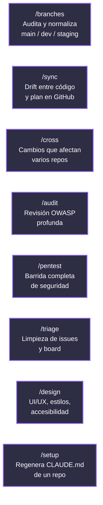
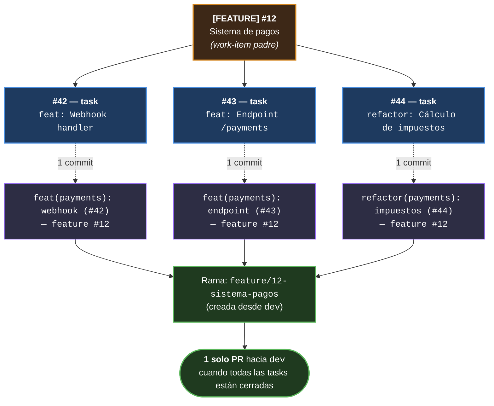

# workspace-template

Convierte cualquier proyecto en un workspace de **Claude Code** con flujo de trabajo profesional listo para usar.

```bash
npx workspace-template
```

Sin clonar, sin configurar nada antes.

---

## Qué te da

- **Flujo work-item / tasks**: planifica, implementa y lanzas PRs siguiendo un patrón estándar (estilo Linear / Vercel).
- **Skills de Claude Code**: comandos como `/init`, `/plan`, `/apply`, `/build`, `/review` que automatizan el ciclo completo.
- **Modelo de branches**: `main` + `dev` (obligatoria) + `staging` (opcional), creadas y normalizadas por el CLI.
- **Integración con GitHub**: issues, sub-issues nativos, PRs, GitHub Projects — todo conectado.
- **Conventional Commits** + drift detection automático contra `dev`.
- **Single-repo o multi-repo** indistintamente.

## Inicio rápido

**Sin Node.js instalado:**
```bash
curl -fsSL https://raw.githubusercontent.com/Dev3ch/workspace_template/main/setup.sh | bash
```

**Con Node.js:**
```bash
npx workspace-template
```

El CLI te guía paso a paso (en español).

## Cómo funciona — en 30 segundos

Hay tres niveles de uso. Empieza por el básico.

### Flujo básico (el 80% del tiempo)

```
/init  →  /plan  →  /apply  →  /build  →  (review en GitHub)  →  merge
```

- **`/init`** — arranca la sesión. Te pone en `dev`, lista tus work-items pendientes y te pregunta qué quieres hacer.
- **`/plan`** — propone un work-item (feature / refactor / fix / chore) con sus tasks. **Pide confirmación** antes de crear nada en GitHub.
- **`/apply`** — implementa la task activa, corre tests.
- **`/build`** — commit + push (con tu confirmación) por cada task. Cuando todas las tasks del work-item están cerradas, abre **un solo PR** hacia `dev`.

Tras el merge, `/build` cierra el work-item, sus tasks colgantes y limpia la rama — todo automático. Para la siguiente sesión arrancas con `/init` de nuevo.

**Conversacional:** no necesitas escribir los slash commands literalmente. Si dices "planifiquemos un sistema de notificaciones" o "vamos a aplicar la siguiente task", Claude interpreta y avanza solo.

### Flujo completo (con soporte y producción)

Una vez configurado, en cualquier sesión de Claude Code tienes los siguientes comandos. La parte central es el flujo básico de arriba; el resto entra cuando hay algo extra: tests fallan, hay drift contra `dev`, vas a producción, o necesitas auditar seguridad.

```mermaid
flowchart TD
    Start([Arrancar sesión]) --> Init["/init<br/>━━━━━━━<br/>• Lee issues / PRs / work-items<br/>• Posiciona en <code>dev</code><br/>• Detecta drift en tus ramas<br/>• Pregunta qué hacer"]

    Init --> Decide{¿Qué hacer?}
    Decide -->|Continuar work-item<br/>en progreso| Apply
    Decide -->|Empezar work-item<br/>asignado| Apply
    Decide -->|Planificar algo<br/>nuevo| Plan

    Plan["/plan<br/>━━━━━━━<br/>• Propone work-item + tasks<br/>• Pide CONFIRMACIÓN<br/>• Crea issues vinculados<br/>• Agrega al GitHub Project<br/>• Crea rama del work-item"]
    Plan --> Apply

    Apply["/apply<br/>━━━━━━━<br/>• Detecta drift vs <code>dev</code><br/>• Lee plan de la task activa<br/>• Implementa código<br/>• Corre tests<br/>• Marca subtareas hechas"]
    Apply --> TestsOK{Tests OK?}

    TestsOK -->|NO| Debug["/debug<br/>━━━━━━━<br/>• Analiza error / log<br/>• Identifica causa raíz<br/>• Aplica fix"]
    Debug --> Apply

    TestsOK -->|SÍ| Build["/build<br/>━━━━━━━<br/>• CONFIRMA commit<br/>• CONFIRMA push<br/>• Cierra la task"]

    Build --> MoreTasks{¿Quedan más<br/>tasks en el<br/>work-item?}
    MoreTasks -->|SÍ| Apply
    MoreTasks -->|NO| FinalPR["/build<br/>━━━━━━━<br/>• Detecta drift BLOQUEANTE<br/>• CONFIRMA abrir PR único<br/>(todas las tasks → <code>dev</code>)"]

    FinalPR --> Review["/review<br/>━━━━━━━<br/>• Code review del PR<br/>• Checklist completo<br/>• Bloqueantes / mejoras"]
    Review --> Merge([Merge a <code>dev</code>])

    Merge --> ToProd{¿Va a<br/>producción?}
    ToProd -->|NO| Stay([Sigue en <code>dev</code>])
    ToProd -->|SÍ| Secure["/secure<br/>━━━━━━━<br/>Checklist BLOQUEANTE:<br/>• env vars<br/>• secrets en GitHub<br/>• CVEs<br/>• Dockerfile / CI"]

    Secure --> Deploy["/deploy<br/>━━━━━━━<br/>• Genera Dockerfile<br/>• GitHub Actions<br/>• Configura secrets<br/>• Primer deploy"]

    Deploy --> Broke{¿Algo se<br/>rompió?}
    Broke -->|NO| Done([Producción ✓])
    Broke -->|SÍ| Rollback["/rollback<br/>━━━━━━━<br/>• Revierte deploy<br/>• Crea post-mortem"]

    classDef cmd fill:#1e3a5f,stroke:#4a90e2,stroke-width:2px,color:#fff
    classDef decision fill:#3d2817,stroke:#d4861f,stroke-width:2px,color:#fff
    classDef terminal fill:#1f3a1f,stroke:#5cb85c,stroke-width:2px,color:#fff
    class Init,Plan,Apply,Debug,Build,FinalPR,Review,Secure,Deploy,Rollback cmd
    class Decide,TestsOK,MoreTasks,ToProd,Broke decision
    class Start,Merge,Stay,Done terminal

    click Init "templates/skills/init.md" "Ver skill /init"
    click Plan "templates/skills/plan.md" "Ver skill /plan"
    click Apply "templates/skills/apply.md" "Ver skill /apply"
    click Debug "templates/skills/debug.md" "Ver skill /debug"
    click Build "templates/skills/build.md" "Ver skill /build"
    click FinalPR "templates/skills/build.md" "Ver skill /build"
    click Review "templates/skills/review.md" "Ver skill /review"
    click Secure "templates/skills/secure.md" "Ver skill /secure"
    click Deploy "templates/skills/deploy.md" "Ver skill /deploy"
    click Rollback "templates/skills/rollback.md" "Ver skill /rollback"
```



### Resumen rápido

| Etapa | Comando | Para qué |
|---|---|---|
| Arrancar | [`/init`](templates/skills/init.md) | Lee estado, work-items activos, sincroniza con `dev` |
| Planificar | [`/plan`](templates/skills/plan.md) | Crea work-item (feature / refactor / fix / chore) + tasks |
| Implementar | [`/apply`](templates/skills/apply.md) | Trabaja la task activa, corre tests |
| Guardar | [`/build`](templates/skills/build.md) | Commit + push + abre PR cuando todas las tasks cierran |
| Revisar | [`/review`](templates/skills/review.md) | Code review del PR antes de mergear |
| Pre-deploy | [`/secure`](templates/skills/secure.md) | Checklist bloqueante (env vars, secrets, CVEs) |
| Deploy | [`/deploy`](templates/skills/deploy.md) | Genera Dockerfile, GitHub Actions, primer deploy |

### Comandos de soporte



### Reglas clave del flujo

1. **Toda planificación bajo un work-item padre** (feature / refactor / fix / chore).
2. **Una rama por work-item**, prefijo según su tipo (`feature/N-...`, `refactor/N-...`, `fix/N-...`, `chore/N-...`).
3. **Una task = un commit** (Conventional Commits con doble referencia).
4. **Un work-item = un PR único** al cerrar todas sus tasks.
5. **Confirmación obligatoria** antes de commit, push y apertura de PR — cada vez, sin excepciones.
6. **Drift detection automático** en `/init`, `/apply`, `/build` — Claude avisa si tu rama está atrás de `dev` y ofrece sincronizar.
7. **Conversacional** — Claude interpreta intención y avanza solo, sin que escribas cada slash command.
8. **Cambio de rama seguro en `/init`** — si tienes cambios sin commitear o commits sin push, Claude **no se mueve**: te ofrece commit, stash o quedarte en la rama. Nunca usa `checkout -f` ni `reset --hard`.
9. **Cierre automático post-merge** — al mergear el PR, `/build` cierra el work-item, sus tasks colgantes y ofrece borrar la rama. Nada queda `in-progress` si el work-item ya está completo.
10. **Lectura mínima de issues** — `/apply` y `/init` solo cargan los **abiertos** y filtran del lado server. Aunque tengas miles de issues en el repo, solo viajan los relevantes.

### Qué NO hace Claude solo

Para que sepas dónde vas a tener que decidir tú:

- **Commits, push, abrir PR** — siempre con tu confirmación.
- **Rebase / merge** — Claude detecta drift y propone, tú eliges.
- **Borrar ramas locales o remotas** — se confirma.
- **Mergear el PR** — eso lo haces tú o el reviewer en GitHub.
- **Improvisar credenciales** — si `.claude-credentials` no funciona, Claude para y te lo dice. No prueba alternativas creativas.

## Modelo de trabajo

Toda planificación se agrupa bajo un **work-item padre** (issue con label `feature`, `refactor`, `fix` o `chore`). Sus **tasks** son sub-issues vinculados nativamente. Una rama por work-item, un commit por task, **un solo PR** al cerrar todas las tasks.



**Prefijo de la rama según el tipo del work-item:**
`feature/N-...`, `refactor/N-...`, `fix/N-...`, `chore/N-...`

**Tasks descubiertas durante el desarrollo** se agregan al mismo work-item padre (si forman parte de cerrar bien lo que estás haciendo). Si es un problema de algo ya en producción → nuevo work-item de tipo `fix`.

## Single-repo vs Multi-repo

- **Single-repo**: un solo repositorio. Tres caminos: ya en GitHub, carpeta local, desde cero (clona template del stack).
- **Multi-repo**: varios repos en una carpeta workspace. Pegas todas las URLs / rutas de una vez. Cada repo es autosuficiente con su propio `CLAUDE.md`.

## Actualizar un workspace existente

```bash
npx workspace-template update
```

Compara hash por hash skills, rules y scripts contra el paquete actual. Marca cada cambio:

| Símbolo | Significa |
|---|---|
| `+` | Nuevo en el template, no estaba en tu workspace |
| `~` | Actualizado upstream, sin cambios locales tuyos |
| `!` | Actualizado upstream **pero tienes cambios locales** (default unchecked) |
| `-` | Obsoleto, ya no existe en el template (default checked = se elimina) |
| `×` | Lo borraste localmente — **no se reinstala** salvo que lo marques explícitamente |

Eliges qué aplicar. **Tus cambios locales se respetan por defecto:**

- Si modificaste un skill localmente, el update no lo sobrescribe a menos que lo elijas.
- Si borraste un archivo del template a propósito (porque no lo usabas), el update **no lo trae de vuelta**. Aparece marcado con `×` para que lo recuperes solo si lo decides.
- Si añadiste skills/rules tuyos que no son del template, el updater no los toca ni los lista.

## Stacks soportados

Next.js / React, Vue / Nuxt, Django, FastAPI, React Native, Flutter, Go, o cualquier otro como texto libre. Si el repo tiene manifest detectable (`package.json`, `pyproject.toml`, `go.mod`, etc.), el CLI lo detecta automáticamente. Si no, no te pregunta por stack — sirve igual para repos de configuración o agentes.

## Integraciones MCP

Notion, Linear, Slack, Sentry, Postgres, Context7, n8n. La config queda en `.claude/settings.json`.

## Requisitos

- Node.js 18+ (recomendado: 22 LTS)
- `git` y `gh` (GitHub CLI)

El CLI detecta lo que falta y muestra el comando de instalación según tu OS.

## Más

- [CHANGELOG.md](CHANGELOG.md) — todas las versiones y cambios
- [docs/flujo-autenticacion.md](docs/flujo-autenticacion.md) — cómo el CLI resuelve credenciales

## Licencia

MIT
