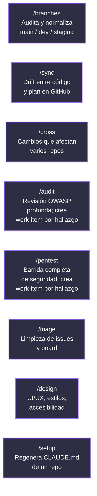
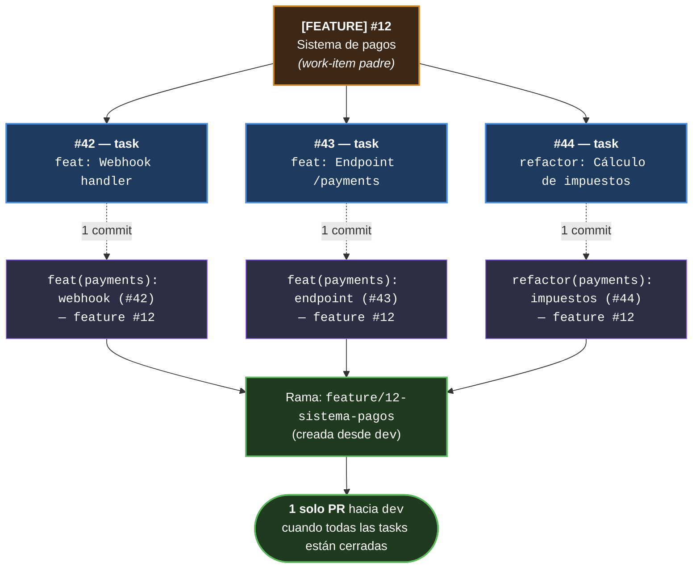

# Arquitectura del flujo

Documento de referencia con el flujo completo de `workspace-template` — todos los comandos, el modelo de trabajo y las reglas.

Si vienes desde el [README](../README.md) y solo quieres arrancar, ahí encuentras el quickstart y los ejemplos básicos. Este doc es para entender **cómo encaja todo**.

---

## Flujo completo

Una vez configurado, en cualquier sesión de Claude Code tienes los siguientes comandos. La parte central es `/init` → `/plan` → `/apply` → `/build`; el resto entra cuando hay algo extra: tests fallan, hay drift contra `dev`, vas a producción, o necesitas auditar seguridad.

```mermaid
flowchart TD
    Start([Arrancar sesión]) --> Init["/init<br/>━━━━━━━<br/>• Lee issues / PRs / work-items<br/>• Posiciona en <code>dev</code><br/>• Detecta drift en tus ramas<br/>• Pregunta qué hacer"]

    Init --> Decide{¿Qué hacer?}
    Decide -->|Continuar work-item<br/>en progreso| Apply
    Decide -->|Empezar work-item<br/>asignado| Apply
    Decide -->|Planificar algo<br/>nuevo| Plan

    Plan["/plan<br/>━━━━━━━<br/>• Propone work-item + tasks<br/>• Pide CONFIRMACIÓN<br/>• Crea issues vinculados<br/>• Agrega al GitHub Project<br/>• Crea rama del work-item"]
    Plan --> Apply

    Apply["/apply<br/>━━━━━━━<br/>• Detecta drift vs <code>dev</code><br/>• Lee plan de la task activa<br/>• Implementa código<br/>• Corre tests<br/>• Marca subtareas hechas"]
    Apply --> TestsOK{Tests OK?}

    TestsOK -->|NO| Debug["/debug<br/>━━━━━━━<br/>• Analiza error / log<br/>• Identifica causa raíz<br/>• Aplica fix"]
    Debug --> Apply

    TestsOK -->|SÍ| Build["/build<br/>━━━━━━━<br/>• CONFIRMA commit<br/>• CONFIRMA push<br/>• Cierra la task"]

    Build --> MoreTasks{¿Quedan más<br/>tasks en el<br/>work-item?}
    MoreTasks -->|SÍ| Apply
    MoreTasks -->|NO| FinalPR["/build<br/>━━━━━━━<br/>• Detecta drift BLOQUEANTE<br/>• CONFIRMA abrir PR único<br/>(todas las tasks → <code>dev</code>)"]

    FinalPR --> Review["/review<br/>━━━━━━━<br/>• Code review del PR<br/>• Checklist completo<br/>• Bloqueantes / mejoras"]
    Review --> Merge([Merge a <code>dev</code>])

    Merge --> ToProd{¿Va a<br/>producción?}
    ToProd -->|NO| Stay([Sigue en <code>dev</code>])
    ToProd -->|SÍ| Secure["/secure<br/>━━━━━━━<br/>Checklist BLOQUEANTE:<br/>• env vars<br/>• secrets en GitHub<br/>• CVEs<br/>• Dockerfile / CI<br/><i>crea work-item si hay bloqueantes</i>"]

    Secure --> Deploy["/deploy<br/>━━━━━━━<br/>• Diagnóstico de estado<br/>• Genera Dockerfile<br/>• GitHub Actions<br/>• Configura secrets<br/><i>crea work-item con tasks por componente</i>"]

    Deploy --> Broke{¿Algo se<br/>rompió?}
    Broke -->|NO| Done([Producción ✓])
    Broke -->|SÍ| Rollback["/rollback<br/>━━━━━━━<br/>• Revierte deploy<br/>• Crea post-mortem"]

    classDef cmd fill:#1e3a5f,stroke:#4a90e2,stroke-width:2px,color:#fff
    classDef decision fill:#3d2817,stroke:#d4861f,stroke-width:2px,color:#fff
    classDef terminal fill:#1f3a1f,stroke:#5cb85c,stroke-width:2px,color:#fff
    class Init,Plan,Apply,Debug,Build,FinalPR,Review,Secure,Deploy,Rollback cmd
    class Decide,TestsOK,MoreTasks,ToProd,Broke decision
    class Start,Merge,Stay,Done terminal

    click Init "../templates/skills/init.md" "Ver skill /init"
    click Plan "../templates/skills/plan.md" "Ver skill /plan"
    click Apply "../templates/skills/apply.md" "Ver skill /apply"
    click Debug "../templates/skills/debug.md" "Ver skill /debug"
    click Build "../templates/skills/build.md" "Ver skill /build"
    click FinalPR "../templates/skills/build.md" "Ver skill /build"
    click Review "../templates/skills/review.md" "Ver skill /review"
    click Secure "../templates/skills/secure.md" "Ver skill /secure"
    click Deploy "../templates/skills/deploy.md" "Ver skill /deploy"
    click Rollback "../templates/skills/rollback.md" "Ver skill /rollback"
```

## Tabla de comandos del flujo principal

| Etapa | Comando | Para qué |
|---|---|---|
| Arrancar | [`/init`](../templates/skills/init.md) | Lee estado, work-items activos, sincroniza con `dev` |
| Planificar | [`/plan`](../templates/skills/plan.md) | Crea work-item (feature / refactor / fix / chore) + tasks |
| Implementar | [`/apply`](../templates/skills/apply.md) | Trabaja la task activa, corre tests |
| Guardar | [`/build`](../templates/skills/build.md) | Commit + push + abre PR cuando todas las tasks cierran |
| Revisar | [`/review`](../templates/skills/review.md) | Code review del PR antes de mergear |
| Pre-deploy | [`/secure`](../templates/skills/secure.md) | Checklist bloqueante; crea work-item con tasks si hay bloqueantes |
| Deploy | [`/deploy`](../templates/skills/deploy.md) | Diagnóstico + setup; crea work-item con tasks por componente |

## Comandos de soporte

## Reglas clave del flujo

1. **Toda planificación bajo un work-item padre** (feature / refactor / fix / chore).
2. **Una rama por work-item**, prefijo según su tipo (`feature/N-...`, `refactor/N-...`, `fix/N-...`, `chore/N-...`).
3. **Una task = un commit** (Conventional Commits con doble referencia).
4. **Un work-item = un PR único** al cerrar todas sus tasks.
5. **Confirmación obligatoria** antes de commit, push y apertura de PR — cada vez, sin excepciones.
6. **Drift detection automático** en `/init`, `/apply`, `/build` — Claude avisa si tu rama está atrás de `dev` y ofrece sincronizar.
7. **Conversacional** — Claude interpreta intención y avanza solo, sin que escribas cada slash command.
8. **Cambio de rama seguro en `/init`** — si tienes cambios sin commitear o commits sin push, Claude **no se mueve**: te ofrece commit, stash o quedarte en la rama. Nunca usa `checkout -f` ni `reset --hard`.
9. **Cierre automático post-merge** — al mergear el PR, `/build` cierra el work-item, sus tasks colgantes y ofrece borrar la rama. Nada queda `in-progress` si el work-item ya está completo.
10. **Lectura mínima de issues** — `/apply` y `/init` solo cargan los **abiertos** y filtran del lado server. Aunque tengas miles de issues en el repo, solo viajan los relevantes.
11. **Skills generadores siguen el mismo modelo** — `/audit`, `/secure`, `/deploy`, `/pentest` no producen issues planos; cuando hay trabajo accionable crean un work-item padre + sub-issues nativos por hallazgo/bloqueante/componente.

## Qué NO hace Claude solo

Para que sepas dónde vas a tener que decidir tú:

- **Commits, push, abrir PR** — siempre con tu confirmación.
- **Rebase / merge** — Claude detecta drift y propone, tú eliges.
- **Borrar ramas locales o remotas** — se confirma.
- **Mergear el PR** — eso lo haces tú o el reviewer en GitHub.
- **Improvisar credenciales** — si `.claude-credentials` no funciona, Claude para y te lo dice. No prueba alternativas creativas.

## Modelo de trabajo (work-item + sub-issues)

Toda planificación se agrupa bajo un **work-item padre** (issue con label `feature`, `refactor`, `fix` o `chore`). Sus **tasks** son sub-issues vinculados nativamente. Una rama por work-item, un commit por task, **un solo PR** al cerrar todas las tasks.

**Prefijo de la rama según el tipo del work-item:**
`feature/N-...`, `refactor/N-...`, `fix/N-...`, `chore/N-...`

**Tasks descubiertas durante el desarrollo** se agregan al mismo work-item padre (si forman parte de cerrar bien lo que estás haciendo). Si es un problema de algo ya en producción → nuevo work-item de tipo `fix`.

## Skills generadores: cuándo crean work-item y cuándo no

`/audit`, `/secure`, `/deploy` y `/pentest` siguen una regla común: **solo crean work-item cuando hay trabajo accionable**. Si todo está bien, reportan ✓ y terminan sin tocar GitHub.

| Skill | Crea work-item cuando… | Tipo de padre | Tasks (sub-issues) |
|---|---|---|---|
| [`/audit`](../templates/skills/audit.md) | Hay hallazgos Critical/High/Medium en el PR | `[AUDIT] fix` | Una por hallazgo, label `severity-*` + categoría OWASP |
| [`/secure`](../templates/skills/secure.md) | El checklist pre-deploy encuentra bloqueantes | `[SECURITY] fix` | Una por bloqueante, label `severity-*` + categoría del check |
| [`/deploy`](../templates/skills/deploy.md) | Caso B (migración a CI/CD) o Caso C (setup completo) | `[DEPLOY] chore` | Una por componente faltante, label `component-*` |
| [`/pentest`](../templates/skills/pentest.md) | Cualquier hallazgo accionable en la barrida completa | `[PENTEST] chore` | Una por hallazgo, label `severity-*` + categoría |

**Cuándo NO crean work-item:**
- `/audit` solo encontró Low/Info → comentario en el PR, sin issues.
- `/secure` pasa todos los checks → ✓ y permite `/deploy`.
- `/deploy` Caso A (producción ya sana) → ✓ y termina.
- `/pentest` sin hallazgos accionables → ✓ y agenda próximo pentest.

Una vez creado el work-item, los sub-issues se trabajan con el flujo normal: `/apply` por task, `/build` cierra la task, y al cerrar todas se abre un solo PR.
