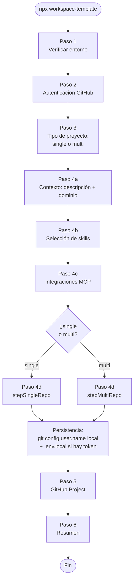
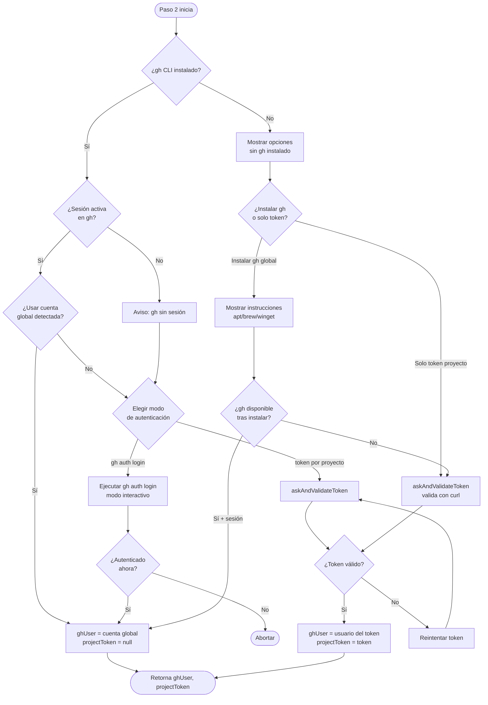
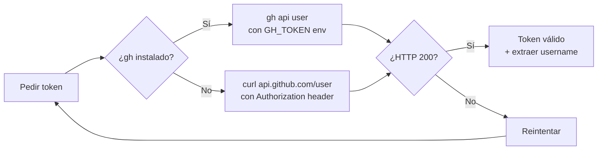
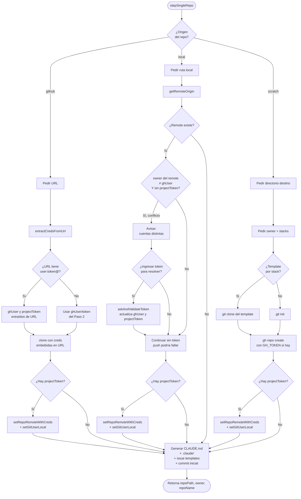
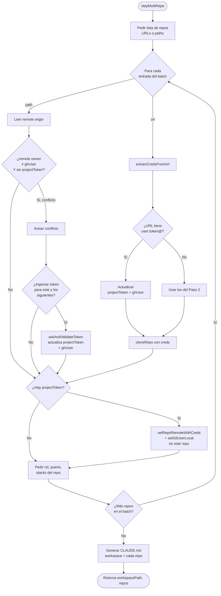
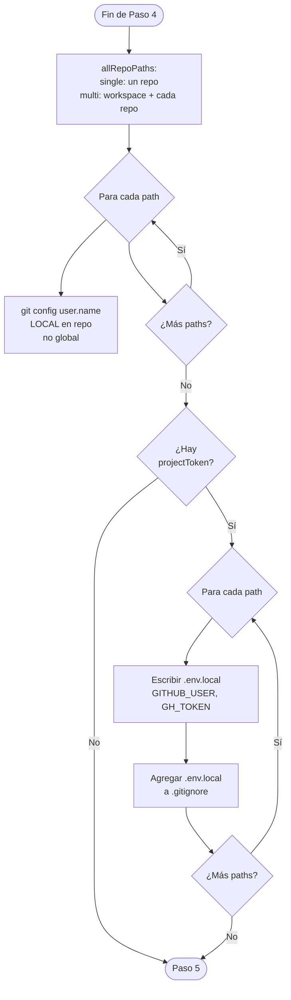
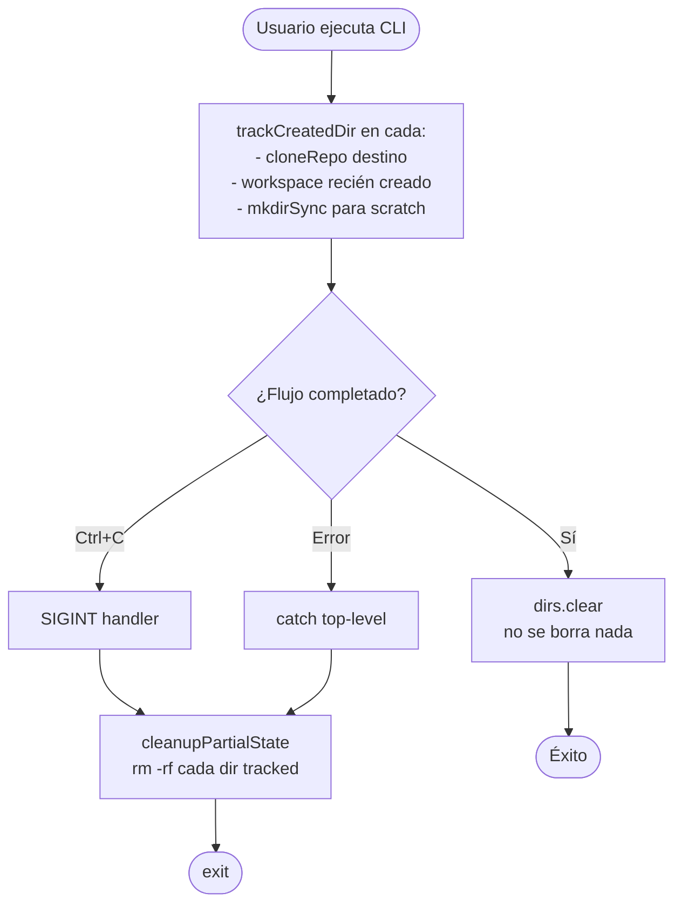

# Flujo de autenticación GitHub y credenciales por proyecto

Este documento describe el flujo completo del CLI `workspace-template`
para autenticar con GitHub y configurar credenciales **por proyecto**
(sin tocar la configuración global de la máquina).

Los diagramas usan [Mermaid](https://mermaid.js.org/). Se renderizan
nativamente en GitHub, VSCode (con extensión Mermaid Preview) y en
cualquier editor compatible.

---

## 1. Flujo maestro — todos los pasos del setup

---

## 2. Paso 2 — Autenticación GitHub (detalle)

Este es el corazón de la lógica nueva: decide si usar cuenta global
de `gh`, si pedir un token por proyecto, o si instalar `gh` por primera vez.

**Validación de token** (`askAndValidateToken`):

---

## 3. Paso 4 — single-repo

Tres caminos: `github`, `local`, `scratch`.

---

## 4. Paso 4 — multi-repo (batch)

El batch procesa múltiples URLs/rutas. Si detecta conflicto o creds
embebidas en medio del batch, el token se propaga a los repos restantes.

**Clave**: el `projectToken` es variable del scope de `stepMultiRepo`.
Si se actualiza en medio del loop (por conflicto o URL con creds),
los repos siguientes del batch ya lo reciben.

---

## 5. Persistencia final

Después de `stepSingleRepo` / `stepMultiRepo`, el flujo principal
persiste configuración en **cada** repo:

**Qué se crea en cada repo:**

| Archivo / Config                              | Cuándo                    | Scope        |
|-----------------------------------------------|---------------------------|--------------|
| `.git/config` → `remote origin` con creds     | Si hay `projectToken`     | Repo local   |
| `.git/config` → `user.name`                   | Siempre                   | Repo local   |
| `.env.local` con `GITHUB_USER` y `GH_TOKEN`   | Si hay `projectToken`     | Archivo repo |
| `.gitignore` → agregar `.env.local`           | Si hay `projectToken`     | Archivo repo |

Nada toca `~/.gitconfig` ni `gh auth login` global.

---

## 6. Matriz de casos cubiertos

| Caso                                                          | Resultado                                                |
|---------------------------------------------------------------|----------------------------------------------------------|
| gh instalado + sesión global + usuario acepta global          | Usa sesión global, sin `.env.local`                      |
| gh instalado + sesión global + usuario quiere otra cuenta     | Pide token por proyecto, guarda `.env.local`             |
| gh instalado sin sesión                                       | Ofrece token proyecto o `gh auth login`                  |
| gh no instalado                                               | Token con validación por curl (sin instalar nada)        |
| URL pegada con `user:token@github.com/...`                    | Extrae creds, **valida antes de clonar**, guarda por proyecto |
| URL con token caducado embebido                               | Preflight lo detecta, ofrece reingresar o continuar sin token |
| Repo local con remote de cuenta distinta + sin token          | Detecta conflicto, ofrece ingresar token                 |
| Repo local sin `.git/`                                        | Single: ofrece `git init`. Multi: se salta               |
| Multi-repo con primer repo en conflicto                       | Token ingresado se aplica al resto del batch             |
| Token ingresado manualmente inválido                          | Reintenta hasta que sea válido                           |
| Usuario cancela con Ctrl+C durante clone                      | Handler SIGINT elimina directorios parciales creados     |
| Usuario cancela prompt con Ctrl+C                             | `ExitPromptError` también dispara limpieza               |
| `.env.local` pre-existente con otras variables                | Preservadas; solo se agregan/actualizan `GITHUB_USER` + `GH_TOKEN` |
| Token en logs                                                 | Siempre enmascarado como `:***@` con `maskUrlCreds()`    |
| Comandos `gh project` (create/view/list)                      | Reciben `GH_TOKEN` del proyecto si aplica                |

---

## 7. Archivos del código relevantes

- [bin/workspace-template.js](../bin/workspace-template.js) — CLI principal
  - `stepGithubAuth` — Paso 2
  - `askAndValidateToken` — validación de token
  - `stepSingleRepo` — 3 caminos (github/local/scratch)
  - `stepMultiRepo` — batch con propagación de token
  - `main` — persistencia final por repo

- [lib/github.js](../lib/github.js) — utilidades git/GitHub
  - `isGhInstalled` — detecta gh CLI
  - `isGitRepo` — detecta si un path tiene `.git/`
  - `checkGhAuth` — estado de sesión global
  - `validateGithubToken` / `validateTokenWithCurl` — valida tokens
  - `extractCredsFromUrl` — parsea `user:token@github.com/...`
  - `maskUrlCreds` — enmascara token para logs (`:***@`)
  - `saveProjectGithubCredentials` — escribe `.env.local` + `.gitignore` (preserva variables existentes)
  - `setRepoRemoteWithCreds` — reescribe `.git/config` remote
  - `setGitUserLocal` — `git config --local user.name`
  - `cloneRepo` — clone con creds embebidas; sanitiza URLs en spinners/errores
  - `createGithubProject` / `getGithubProject` / `listGithubProjects` — aceptan `token` opcional para usar `GH_TOKEN` del proyecto

## 8. Manejo de interrupciones

El CLI tiene un tracker global de directorios creados (`createdResources.dirs`)
para poder limpiar estado parcial si el usuario cancela:

**Importante**: solo se eliminan directorios **creados por este setup**,
nunca directorios que ya existían antes.
